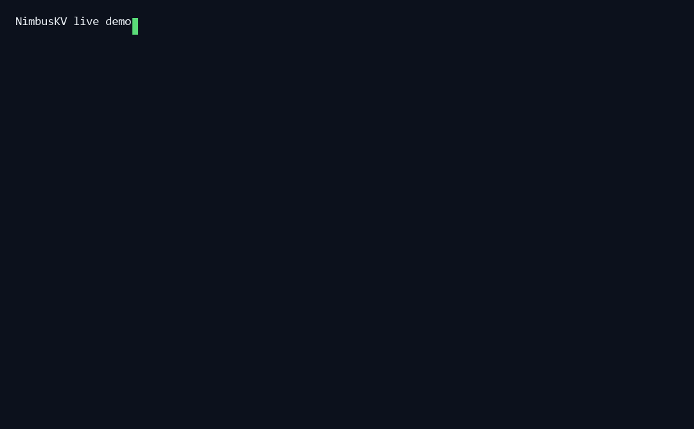
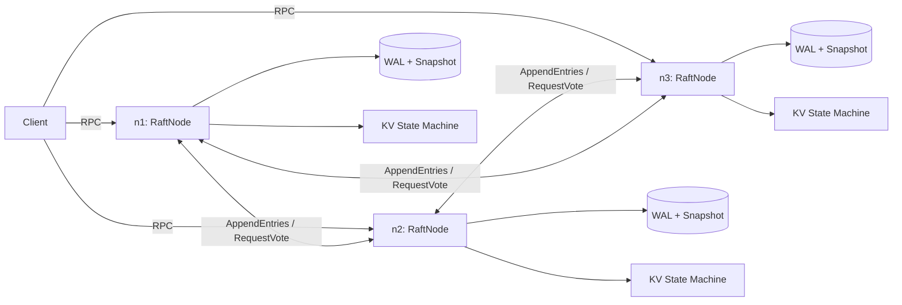

# NimbusKV

[](https://github.com/WuxieLUK/nimbus-kv/actions/workflows/ci.yml)
[](https://python.org)
[](LICENSE)

**NimbusKV** 是一个零第三方依赖、从零实现 Raft 一致性协议的分布式键值存储。项目不调用 etcd / hashicorp/raft / Zookeeper，全部核心逻辑使用 Python 标准库完成，目标是证明：分布式系统最难的部分可以被清晰地构建、测试和讲解。

> A dependency-free distributed key-value store implementing the Raft consensus algorithm from scratch in Python.

## 为什么是它

你的仓库已经有不少应用层项目：RAG、智能体、校园交易平台、健康管理、职业规划。这个仓库补齐的是 **分布式系统 / 云原生基础设施** 这一类技术底座项目，也是竞赛答辩中容易被评委追问、也最容易体现硬实力的方向。

## 功能特性

- **Raft 核心三件套**：领导者选举、日志复制、日志压缩（Snapshot）
- **强一致读写**：写请求由 leader 提交到多数派后才返回；读请求使用 heartbeat quorum 做线性一致读
- **崩溃恢复**：WAL + 原子快照持久化，节点重启后从磁盘恢复
- **自动故障转移**：杀掉 leader 后集群自动选出新 leader，客户端自动发现新 leader
- **自动重定向客户端**：`NimbusClient` 不依赖固定 leader 地址
- **监控面板**：可选 HTTP dashboard 展示节点角色、term、commit index
- **故障注入基准**：`benchmarks/fault_injection.py` 循环杀 leader 并测量恢复时间
- **零依赖**：只用 Python 标准库，便于评审、教学和 CI

## 面试演示



```bash
python demo.py
```

一条命令启动三节点集群 → 写入数据 → 杀死 leader → 自动恢复 → 读出数据。

完整面试答辩材料见 [`INTERVIEW.md`](INTERVIEW.md)。

## 快速开始

要求 Python 3.10+，无需安装任何第三方依赖。

```bash
# 终端 1
python -m nimbus_kv server --id n1 --nodes "n1=127.0.0.1:8001,n2=127.0.0.1:8002,n3=127.0.0.1:8003" --data-dir data --http-port 9001

# 终端 2
python -m nimbus_kv server --id n2 --nodes "n1=127.0.0.1:8001,n2=127.0.0.1:8002,n3=127.0.0.1:8003" --data-dir data --http-port 9002

# 终端 3
python -m nimbus_kv server --id n3 --nodes "n1=127.0.0.1:8001,n2=127.0.0.1:8002,n3=127.0.0.1:8003" --data-dir data --http-port 9003
```

新开一个终端：

```bash
python -m nimbus_kv client --nodes "n1=127.0.0.1:8001,n2=127.0.0.1:8002,n3=127.0.0.1:8003" put hello world
python -m nimbus_kv client --nodes "n1=127.0.0.1:8001,n2=127.0.0.1:8002,n3=127.0.0.1:8003" get hello
python -m nimbus_kv client --nodes "n1=127.0.0.1:8001,n2=127.0.0.1:8002,n3=127.0.0.1:8003" status
```

打开 `http://127.0.0.1:9001/` 可以查看集群状态。

## 故障转移演示

启动三节点后，直接终止当前 leader 进程，然后再次执行 `get`，数据仍然可读：

```bash
python -m nimbus_kv client --nodes "n1=127.0.0.1:8001,n2=127.0.0.1:8002,n3=127.0.0.1:8003" get hello
```

也可以自动化执行故障注入：

```bash
python benchmarks/fault_injection.py --rounds 10
```

## 架构



- `nimbus_kv/raft.py`：选举、复制、commit、snapshot、线性一致读
- `nimbus_kv/log.py`：支持快照基地址的 Raft log
- `nimbus_kv/persistent.py`：WAL 与原子快照
- `nimbus_kv/rpc.py`：长度前缀 JSON 协议
- `nimbus_kv/client.py`：leader 自动发现客户端
- `nimbus_kv/server.py`：TCP 服务与 HTTP dashboard
- `nimbus_kv/cli.py`：命令行入口

## 测试

```bash
python -m unittest discover -s tests -v
```

测试覆盖日志冲突截断、状态机、持久化恢复，以及一个真实三进程集群的 **杀 leader 后故障转移** 集成测试。

## 竞赛答辩定位

- **技术深度**：完整实现 Raft 安全性规则，而不是简单封装现成库
- **可验证性**：集成测试和故障注入脚本提供可复现证据
- **工程能力**：持久化、并发、网络协议、客户端重试、监控面板
- **可扩展性**：状态机接口独立，可把 KV 替换为计数器、队列或其他业务状态机

更多细节见 [`docs/design.md`](docs/design.md) 和 [`docs/competition.md`](docs/competition.md)。

## License

[MIT](LICENSE)
